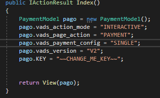
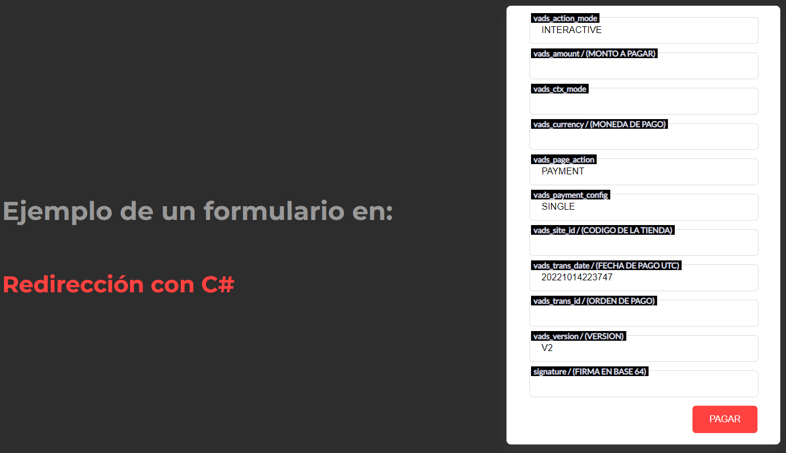

# Redirect-PaymentForm.Net

Ejemplo del formulario en REDIRECCION de Izipay con C# .NET, para poder ejecutar el siguiente ejemplo seguir los pasos del presente manual.


<a name="Requisitos_Previos"></a>
## Requisitos Previos

* Extraer credenciales del Back Office Vendedor. [Guía Aquí](https://github.com/izipay-pe/obtener-credenciales-de-conexion)
* Descargar el manual desde [Manual Izipay - implementación en REDIRECCIÓN](https://secure.micuentaweb.pe/doc/es-PE/form-payment/quick-start-guide/sitemap.html).
* Instalar Visual Studio [Aquí](https://visualstudio.microsoft.com/es/)
* Version de .NET CORE de 3 en adelante

## 1.- Crear el proyecto
Descargar el proyecto .zip haciendo click [Aquí](https://github.com/izipay-pe/Redirect-PaymentForm.Net/archive/refs/heads/main.zip) o clonarlo desde Git.
```sh
git clone https://github.com/izipay-pe/Redirect-PaymentForm.Net.git
``` 
* Correr con IIS Express de manera Local 
* Ejecútelo y pruébelo con el siguiente comando: `F5` desde la Vista `Home` `Index.cshtml` y abrira con su navegador web predeterminado

  ver el resultado en: "https://localhost:44345/"

## 2.- Configurar datos de conexión

**Nota**: Reemplace **[CHANGE_ME]** con su credencial de `Claves` extraída desde el Back Office Vendedor, ver [Requisitos Previos](#Requisitos_Previos).

* Editar el archivo en la siguiente ruta `RedirectPaymentForm -> Controllers -> HomeController.cs` con las claves de su Back Office Vendedor

     

  ```c#   
  public IActionResult Index()
        {
            PaymentModel pago = new PaymentModel();
            pago.vads_action_mode = "INTERACTIVE";
            pago.vads_page_action = "PAYMENT";
            pago.vads_payment_config = "SINGLE";
            pago.vads_version = "V2";
            pago.KEY = "~~CHANGE_ME_KEY~~";

            return View(pago);
        }  
  ```
     
## 3.- Transacción de prueba

El formulario de pago está listo, puede intentar realizar una transacción utilizando una tarjeta de prueba. Consulte tarjetas de prueba [Aquí](https://secure.micuentaweb.pe/doc/es-PE/rest/V4.0/api/kb/test_cards.html).   

*Número de tarjeta*: 4970100000000055   
*Fecha de vencimiento*: 12/30   
*Código de seguridad*: 123
 
## 4.- Implementar IPN

IPN son las siglas de Instant Payment Notification (URL de notificación instantánea, en inglés). Al crear una transacción o cambiar su estado, nuestros servidores emitirán una IPN que llamará a una URL de notificación en sus servidores. Esto le permitirá estar informado en tiempo real de los cambios realizados en una transacción.

Las IPN son la única manera de recibir notificaciones en los casos siguientes:

* La conexión a Internet del comprador se ha cortado.
* El comprador cierra su navegador durante el pago.
* Se ha rechazado una transacción.
* El comprador no ha terminado su pago antes de la expiración de su sesión de pago.

Por lo tanto, es obligatorio integrar las IPN.

 <p align="center">
     
   </p>  

* Ver manual de implementacion de la IPN [Aquí](https://secure.micuentaweb.pe/doc/es-PE/rest/V4.0/kb/payment_done.html)

* Ver el ejemplo de la respuesta IPN con PHP [Aquí](https://github.com/izipay-pe/Redirect-PaymentForm-IpnT1-PHP)

* Ver el ejemplo de la respuesta IPN con NODE.JS [Aquí](https://github.com/izipay-pe/Response-PaymentFormT1-Ipn)

                                      


