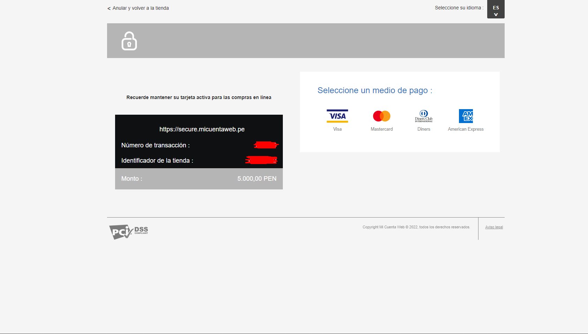
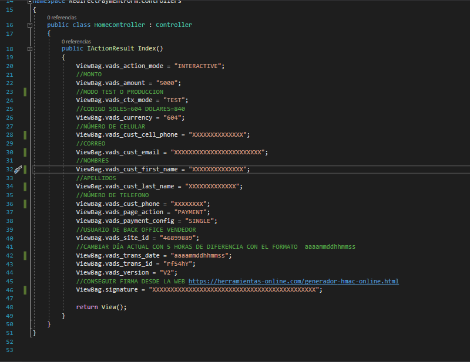
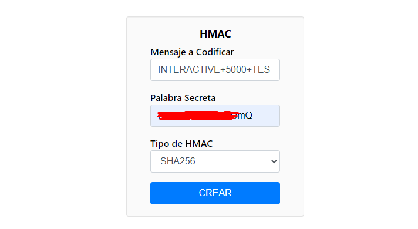
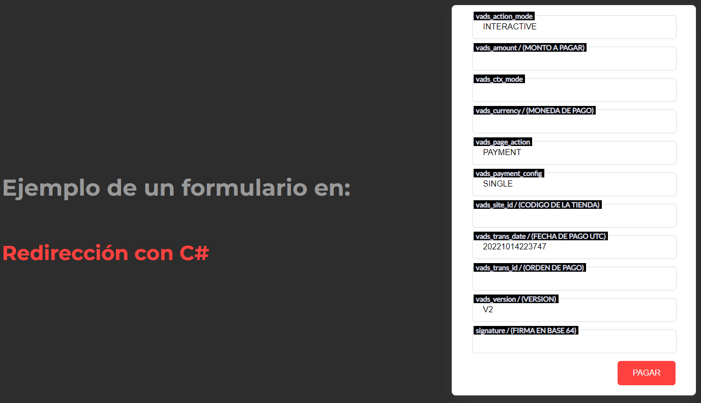

# Redirect-PaymentForm-T1.Net

Ejemplo del formulario en REDIRECCION de Izipay con C# .NET.


## Requisitos Previos

* Instalar Visual Studio [Aquí](https://visualstudio.microsoft.com/es/)
* Version de .NET CORE de 3 en adelante

## 1.- Descargar
Descargar el proyecto .zip haciendo click [Aquí](https://github.com/izipay-pe/PopIn-PaymentForm-T1.Net/archive/refs/heads/main.zip) o clonarlo desde Git.
```sh
git clone https://github.com/izipay-pe/PopIn-PaymentForm-T1.Net.git
``` 

## 2.- Obtener Claves
* Obtener claves de integración, [Ver ejemplo](https://github.com/izipay-pe/obtener-credenciales-de-conexion#readme)
* Editar el archivo `HomeController.cs` con los datos que quieren enviar solo editar los campos que estan con un comentario encima //
 
## 3.- Configurar los Datos a enviar


## 4.- Conseguir firma desde un Generador Online
* Ingresar al Generador Online haciendo click [Aquí](https://herramientas-online.com/generador-hmac-online.html)
* En mensaje a Codificar colocar los valores tal cual 
* 
* 



## 5.- Correr Proyecto
* IIS Express
* Correr proyecto con el Explorador Web de su preferencia

## 6.- Demo

