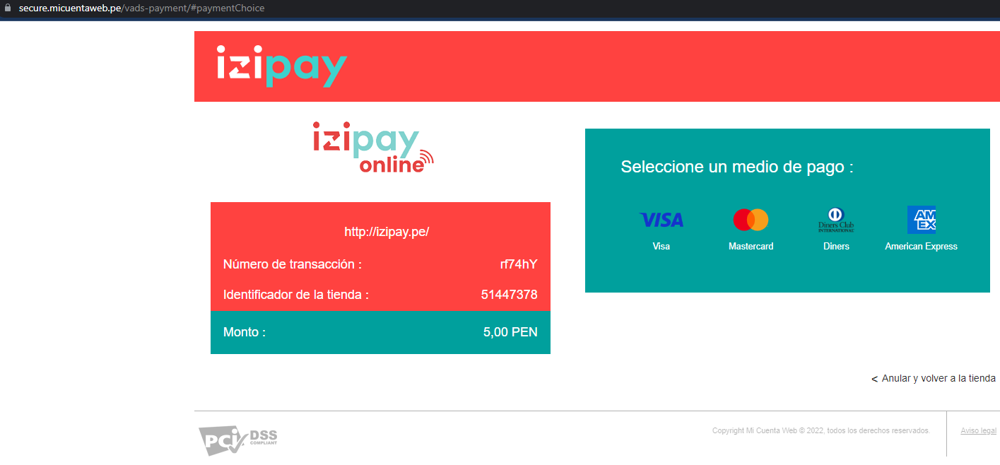

# Redirect-PaymentForm-T1.Net

Ejemplo del formulario en REDIRECCION de Izipay con C# .NET, para poder ejecutar el siguiente ejemplo seguir los pasos del presente manual.



<a name="Requisitos_Previos"></a>
## Requisitos Previos

* Extraer credenciales del Back Office Vendedor. [Guía Aquí](https://github.com/izipay-pe/obtener-credenciales-de-conexion)
* Instalar Visual Studio [Aquí](https://visualstudio.microsoft.com/es/)
* Version de .NET CORE de 3 en adelante

## 1.- Crear el proyecto
Descargar el proyecto .zip haciendo click [Aquí](https://github.com/izipay-pe/Redirect-PaymentForm-T1.Net/archive/refs/heads/main.zip) o clonarlo desde Git.
```sh
git clone https://github.com/izipay-pe/Redirect-PaymentForm-T1.Net.git
``` 
* Correr con IIS Express de manera Local 
* Ejecútelo y pruébelo con el siguiente comando: `F5` desde la Vista `Home` `Index.cshtml` y abrira con su navegador web predeterminado

  ver el resultado en: "https://localhost:44345/"

## 2.- Ejecutar el proyecto, cambiar claves de acceso y demas 

**Nota**: Reemplace **[CHANGE_ME]** con sus credenciales de `API REST` extraídas desde el Back Office Vendedor, ver [Requisitos Previos](#Requisitos_Previos).

* Editar el archivo en la siguiente ruta `RedirectPaymentForm -> Controllers -> HomeController.cs` con las claves de su Back Office Vendedor

  

  ```c#   
  public IActionResult Index()
        {
            PaymentModel pago = new PaymentModel();
            pago.vads_action_mode = "INTERACTIVE";
            pago.vads_page_action = "PAYMENT";
            pago.vads_payment_config = "SINGLE";
            pago.vads_version = "V2";
            pago.KEY = "~~CHANGE_ME_KEY~~";

            return View(pago);
        }  
  ```
  
## 3.- Transacción de prueba

El formulario de pago está listo, puede intentar realizar una transacción utilizando una tarjeta de prueba con la barra de herramientas de depuración (en la parte inferior de la página).

  

Para obtener más información, eche un vistazo a:

- [Formulario incrustado: prueba rápida](https://secure.micuentaweb.pe/doc/es-PE/rest/V4.0/javascript/quick_start_js.html)
- [Primeros pasos: pago simple](https://secure.micuentaweb.pe/doc/es-PE/rest/V4.0/javascript/guide/start.html)
- [Servicios web - referencia de la API REST](https://secure.micuentaweb.pe/doc/es-PE/rest/V4.0/api/reference.html)
 
## 4.- Implementar IPN

* Ver manual de implementacion de la IPN [Aquí](https://secure.micuentaweb.pe/doc/es-PE/rest/V4.0/kb/payment_done.html)

* Ver el ejemplo de la respuesta IPN con PHP [Aquí](https://github.com/izipay-pe/Redirect-PaymentForm-IpnT1-PHP)

* Ver el ejemplo de la respuesta IPN con NODE.JS [Aquí](https://github.com/izipay-pe/Response-PaymentFormT1-Ipn)

                                      


